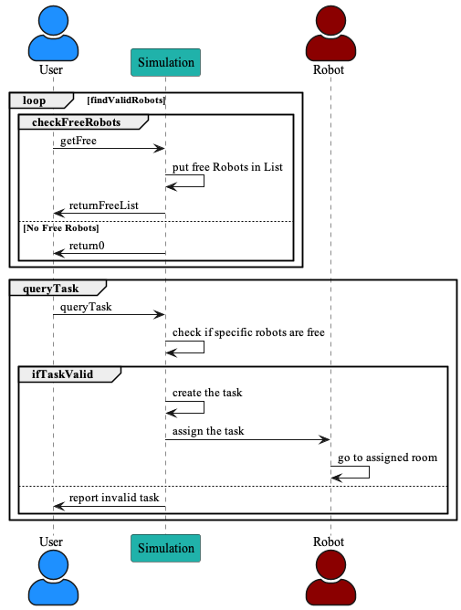
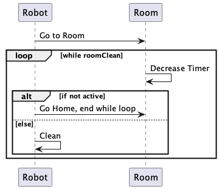

## File for our behavioral diagrams
  
This is a sequence diagram that is showing the steps the user would take to assign a task. The simulation will assign the robots to the task but the user needs to make sure the room is dirty and there is enough robots available.

  
This is a sequence diagram that demonstrates basic steps for a robot behaviors during its task, and its interactions with the Room and Simulation class.

  
This is a activity diagram that shows how the simulation creates a task with the user and ensures that it is a valid task.
