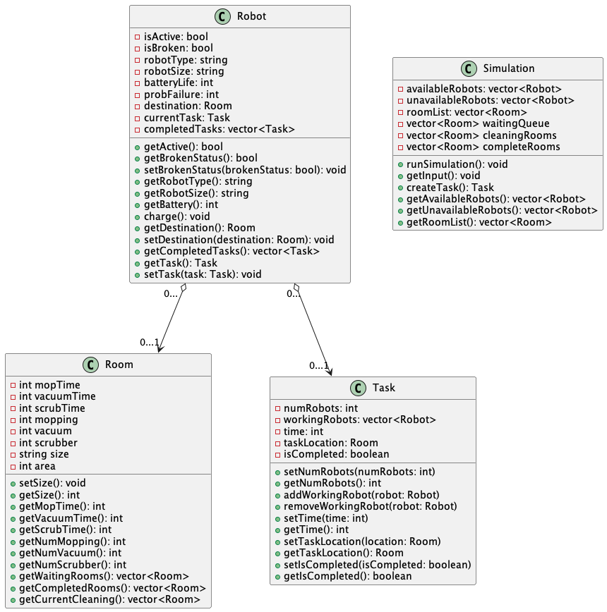

Here is our completed clas diagram.

* Henry: We all drew a base of our class diagram. I created the branches for the folder and the class diagram. I then started putting the robot class in our diagram.
* Lauren: I created the simulation classs in the classdiagrams.
* Ditrick: I created the Task class diagram
* Zhengtao: We dicussed and drew an outline of our class diagram. I created the Room class diagram part.
