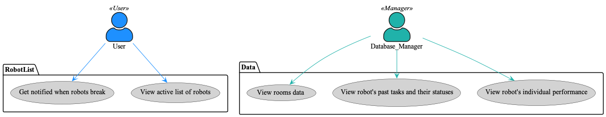
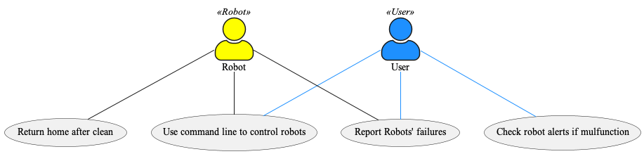
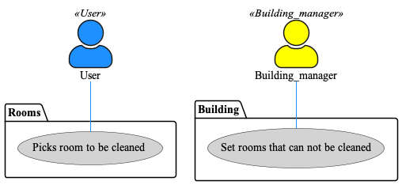

## File for our usecases

This use case is about robot information and data.

This use case is about sending the robots to perform tasks.

This usee case is about decided where to send the robots.

* Henry: I wrote user stories and added some of them to the cards with descriptions. We all talked through how to create the different use case diagrams in class. I also coded usecase1.
* Lauren: We all talked through the different use cases. I wrote the Use case and design .md files.
* Zhengtao: I refined one user story and added it to the cards. Participating meetings about selecting user cases and creating diagram. Coded use case diagram 2.